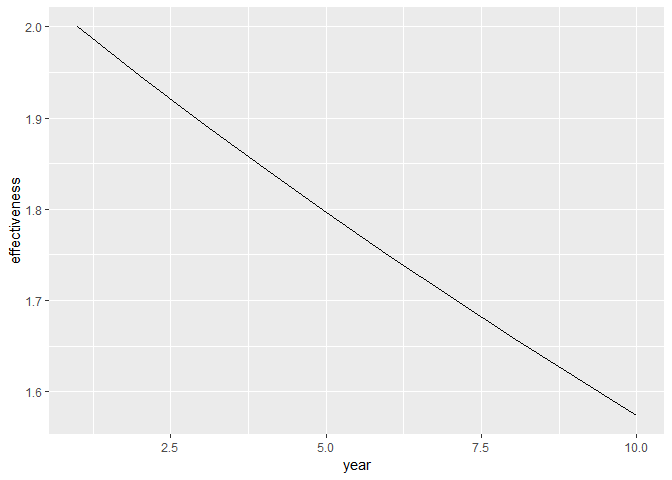
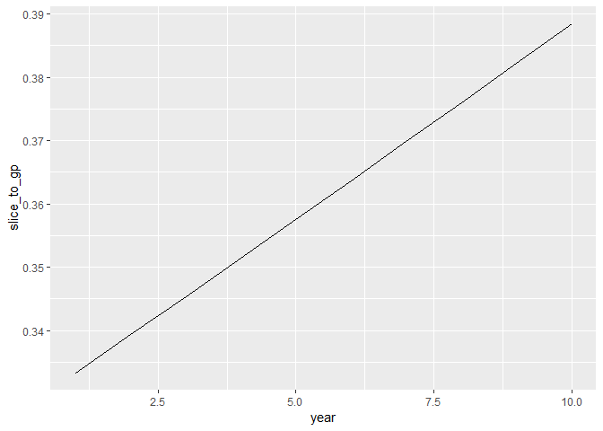

## What is Fee Effectiveness?

In negotiating private equity or joint venture structures, we are faced with the dilemma of how negotiate.  We do not want to undercompensate our partners reducing motivation to work or  incenting to seek alternate capital sources.  Nor do we want to overcompensate them shortchanging ourselves on rewards for the risks we have taken by providing capital to an enterprise.

Another dilemma in assessing fees is that fee drag expressed in terms of percent of capital invested does not consider performance.  Other things equal, a manager who generates 8% excess return and charges 2% fees is better than a manager who generates 2% excess performance and charges 1% in fees.  In the former case, you make 6% net excess return and the manager has captured 25% of the gross excess return as its fee.  In the latter case, you make 1% excess return and the manager has captured 50% of the gross excess return in fees.

Fee effectiveness is the percent of the gross excess return captured by the manager in fees.  It can be expressed as the percent or the ratio of excess return going to the investor divided by the excess return going to the manager

## Fee effectiveness should be measured in dollars 

If you measure fee effectiveness by comparing IRRs, you get a confusing picture.  The following calculations will illustrate this.

Let's say we have an investment that earns 14% per year against a benchmark of 8% and the manager charges 2% in fees.  Measured in percents, it looks you have 1/3 of the excess going to the manager and a fee effectiveness of 2:1.

The fee effectiveness on a simple IRR comparison turns out to be true only for a one period investment.  For longer durations, the effectiveness deteriorates with constant gross to net spread.  Let's check the math. . .


```r
library(ggplot2)
```

```
## Warning: package 'ggplot2' was built under R version 3.4.4
```

```r
year=1:10
gross=1.14^year  #14% gross return compounded
net=1.12^year #12% net return compounded
bench=1.08^year #8% bench compounded
fee=gross-net
excessreturn=net-bench
effectiveness=excessreturn/fee
grossprofit=gross-bench
slice_to_gp=fee/grossprofit
df=data.frame(year,gross,net,bench,fee,effectiveness,slice_to_gp)
df
```

```
##    year    gross      net    bench       fee effectiveness slice_to_gp
## 1     1 1.140000 1.120000 1.080000 0.0200000      2.000000   0.3333333
## 2     2 1.299600 1.254400 1.166400 0.0452000      1.946903   0.3393393
## 3     3 1.481544 1.404928 1.259712 0.0766160      1.895374   0.3453785
## 4     4 1.688960 1.573519 1.360489 0.1154408      1.845365   0.3514488
## 5     5 1.925415 1.762342 1.469328 0.1630729      1.796826   0.3575482
## 6     6 2.194973 1.973823 1.586874 0.2211499      1.749710   0.3636747
## 7     7 2.502269 2.210681 1.713824 0.2915874      1.703973   0.3698261
## 8     8 2.852586 2.475963 1.850930 0.3766232      1.659571   0.3760005
## 9     9 3.251949 2.773079 1.999005 0.4788698      1.616461   0.3821957
## 10   10 3.707221 3.105848 2.158925 0.6013731      1.574602   0.3884096
```


```r
ggplot(df,aes(x=year,y=effectiveness)) + geom_line()
```

<!-- -->

```r
ggplot(df,aes(x=year,y=slice_to_gp)) + geom_line()
```

<!-- -->
